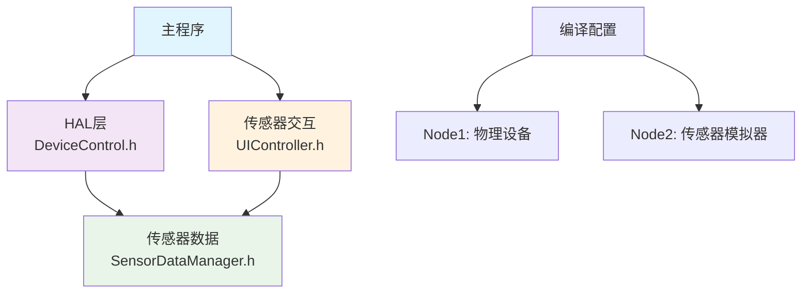

# 通用设备控制器固件

本项目是为智能家居沙盘系统设计的通用ESP32固件，通过MQTT协议接收并执行来自上位机的控制指令。

## 🏗️ 架构设计

**核心理念：** 一个固件 + 条件编译 = 多种节点配置

### 依赖关系


## 📁 项目结构

```
src/
├── GenericDeviceController.ino    # 主程序
├── Config.h                       # 编译配置
├── README.md                      # 项目文档
├── nodeconfig/                    # 节点配置
│   ├── Node1Config.h             # Node1节点配置
│   └── Node2Config.h             # Node2节点配置
├── core/                          # 核心模块
│   └── DeviceControl.h           # 设备控制抽象层
├── sensorsimulator/               # 传感器模拟器模块
│   ├── SensorDataManager.h       # 传感器数据存储和管理
│   ├── SensorDataManager.cpp
│   ├── UIController.h            # 用户交互和数据调节
│   └── UIController.cpp
└── doc/                          # 文档
    ├── UI_Guide.md               # UI界面与交互说明文档
    └── Device_Mapping.md         # 设备映射关系与引脚分配文档
```

## ⚙️ 节点类型

| 节点 | 用途 | 硬件 | 功能 |
|------|------|------|------|
| **Node1** | 设备控制 | GPIO物理设备 | 灯光、空调、门窗控制 |
| **Node2** | 传感器模拟 | TFT屏+编码器 | 温湿度、亮度、烟雾、燃气数据+交互界面 |

## 🚀 快速开始

1. **配置节点**：修改 `Config.h` 中的 `CURRENT_NODE`
2. **设置设备**：编辑对应的 `nodeconfig/NodeXConfig.h`
3. **编译上传**：PlatformIO 或 Arduino IDE

## 📖 详细文档

- 📋 [设备映射与引脚分配](doc/Device_Mapping.md)
- 🎮 [UI界面操作指南](doc/UI_Guide.md)


